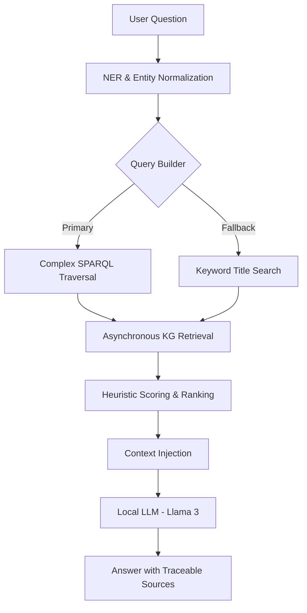

# SCIGRAPH-RAG: Knowledge Graph RAG for Scientific Papers

A high-performance **GraphRAG** pipeline that leverages the [Open Research Knowledge Graph (ORKG)](https://orkg.org/) to provide deterministic, verifiable answers to complex scientific queries. Unlike traditional Vector RAG, this system uses structured SPARQL queries to eliminate hallucinations and provide exact provenance.

## 🚀 Key Features

* **Deterministic Retrieval**: Translates Natural Language into precise SPARQL queries.
* **Intelligent Entity Extraction**: Multi-step NER with few-shot prompting for scientific methods and datasets.
* **Resilient Pipeline**: Implementation of **Timeout Fallbacks** and **Keyword-based Search** if primary graph traversals fail.
* **Heuristic Scoring**: Re-ranks graph results based on entity overlap and field relevance before LLM generation.
* **Fully Local LLM**: Powered by Ollama (Llama 3 / Mistral) for privacy and zero API costs.

## 🏗 Architecture



## 📂 Project Structure

```text
scigraph-rag/
├── backend/
│   ├── api/             # FastAPI layer with Pydantic validation
│   ├── kg/              # SPARQL Client with Async Support & Fallbacks
│   ├── rag/             # The "Brain": Classifier, Builder, and Scorer
│   ├── llm/             # Ollama integration layer
│   └── main.py          # Entry point
├── tests/               # Integration tests for SPARQL & Pipeline
└── Makefile             # Developer shortcuts (make run, make test)

```

## 🛠 Quick Start

### 1. Environment Setup

```bash
# Install pyenv i pyenv-virtualenv ako već nisu instalirani:
# https://github.com/pyenv/pyenv#installation
# https://github.com/pyenv/pyenv-virtualenv#installation

# Instaliraj Python 3.13.6 i kreiraj virtualenv
pyenv install 3.13.6
pyenv virtualenv 3.13.6 scigraph-rag-3.13

# Postavi lokalni virtualenv za ovaj projekt (kreira .python-version)
pyenv local scigraph-rag-3.13

# Instaliraj dependencies i postavi .env
pip install -r requirements.txt
cp .env.example .env

```

### 2. Local LLM Activation

```bash
ollama serve
ollama pull llama3

```

### 3. Execution

```bash
make run  # Runs uvicorn on port 8000

```

## 🧪 Advanced Usage Examples

| Query | Technical Strategy |
| --- | --- |
| *"Papers using CNN on MNIST"* | **Multi-hop traversal**: `Paper -> Contribution -> Method(CNN) & Dataset(MNIST)` |
| *"Deep Learning accuracy"* | **Field-aware retrieval**: Filters by `Research Field: AI` + Semantic ranking |
| *"ResNet ImageNet"* | **Normalization**: Maps "ResNet" to "Residual Neural Network" variants |

## 📊 Why GraphRAG?

| Aspect | Vector RAG | **KG-RAG (This Project)** |
| --- | --- | --- |
| **Logic** | Probability (Top-K chunks) | **Determinism (Triples)** |
| **Accuracy** | Prone to hallucinations | **High (Cites exact KG nodes)** |
| **Reasoning** | Limited to text context | **Graph-based (Multi-hop relations)** |
| **Traceability** | Citation of text block | **Citation of Paper DOI & URI** |

## 🛠 Development & Performance

* **Async Everything**: All KG retrievals are performed concurrently using `httpx` and `asyncio.gather`.
* **Robustness**: Integrated 10s timeout triggers for remote SPARQL endpoints with automatic fallback to title-based search.
* **NER Calibration**: Optimized system prompts to handle both abbreviations (CNN) and long-form scientific terms (Convolutional Neural Networks).

---

## **Author**: David | Built on Arch Linux | **License**: MIT